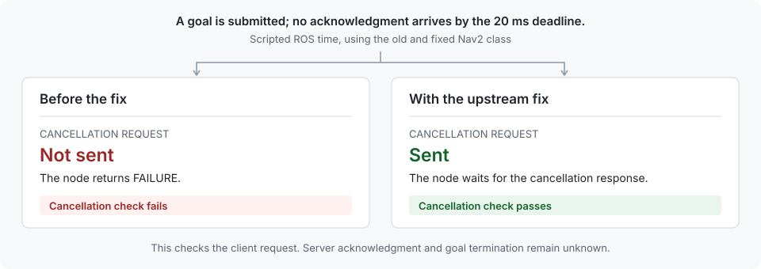

# Reproduce a Nav2 cancellation bug

A Nav2 behavior-tree node could return `FAILURE` after a goal acknowledgment timed out, without asking the action server to cancel the goal. [Navigation2 PR #6373](https://github.com/ros-navigation/navigation2/pull/6373) added the missing cancellation request.

This example uses Rook to capture the old component's behavior, reproduce it, and check the upstream fix against the same inputs. Both versions execute Nav2's `BtActionNode`, with controlled clock readings and action callbacks.

<picture>
  <source media="(max-width: 767px)" srcset="docs/assets/timeout-mobile.svg">
  
</picture>

[Read the recorded result](docs/result.md) · [Run it yourself](#run-it-yourself) · [Follow the code](docs/code-tour.md)

## What Rook adds

The recording becomes a case containing the inputs, original effects, code identities, and a behavioral check. Rook first checks that the old build reproduces the captured effects. It then runs the candidate against the recorded inputs and evaluates the check. You can retain that case and its executable environment to test later changes.

This example demonstrates that workflow for a known bug with scripted inputs. Using it with your own component requires an adapter and a recording of the inputs, timing, and starting state that component needs. This repository has no rosbag importer.

## Run it yourself

You need Git and a running Docker installation. ROS and Rust are installed inside the container. Linux x86_64 is tested; Apple silicon emulation is unverified. The [first CI build](https://github.com/rooksystems/rook-nav2-timeout/actions/runs/35153353742) took about 12 minutes and downloaded several dependencies. Allow several gigabytes of disk space.

```sh
git clone https://github.com/rooksystems/rook-nav2-timeout.git
cd rook-nav2-timeout
./run.sh
```

The final output includes the expected failure of the old version and the passing fix.

```text
timeout / old: FAIL (rook test exit 1)
timeout / fixed: PASS (rook test exit 0)
All 28 candidate checks matched their expected results.
```

A successful run exits 0. The checks also cover timely acknowledgments and missing evidence. The [saved result](docs/result.md) shows the actual cancellation events behind these labels.

To replay your captured cases in a fresh container with networking disabled, run `./replay.sh`. This took about five minutes in the same CI run. [The running guide](docs/running.md) covers Docker permissions, build output, retries, and offline replay.

## Read further

- [Recorded result](docs/result.md) walks through one run, with the original JSON reports.
- [Code tour](docs/code-tour.md) follows the input script through capture, replay, and the cancellation check.
- [Technical reference](native/src/rook_nav2_experiment/README.md) documents the substituted dependencies and the cases the fix leaves unresolved.
- [Contributing](CONTRIBUTING.md) explains how to check a change or report a setup problem.

If you have a failure this workflow might help investigate, [describe the component and the behavior](https://github.com/rooksystems/rook-nav2-timeout/issues). Synthetic examples are welcome; keep private recordings local.

Rook source is [Apache-2.0](LICENSE). See [source provenance](SOURCE.md), [third-party notices](NOTICE), and [dependency licenses](THIRD-PARTY.md). Report vulnerabilities through [the private security channel](SECURITY.md#reporting).
